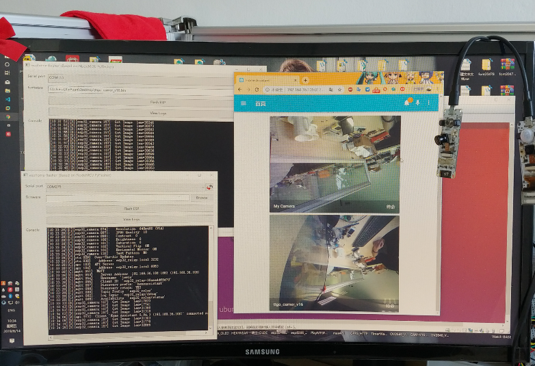

# ESP Home Configure yaml

- TTGO_T_CameraV05
    ```yaml
    esphome:
      name: ttgo_camearv05
      platform: ESP32
      board: esp32dev

    wifi:
      ssid: "ssid"
      password: "password"

    # Enable logging
    logger:

    # Enable Home Assistant API
    api:

    ota:

    mqtt:
      broker: 'ip address'
      username: 'user'
      password: 'password'
    
    # ttgo_camearv05 configuration
    esp32_camera:
      external_clock:
        pin: GPIO32
        frequency: 20MHz
      i2c_pins:
        sda: GPIO13
        scl: GPIO12
      data_pins: [GPIO5, GPIO14, GPIO4, GPIO15, GPIO18, GPIO23, GPIO36, GPIO39]
      vsync_pin: GPIO27
      href_pin: GPIO25
      pixel_clock_pin: GPIO19
      power_down_pin: GPIO26

      # Image settings
      name: ttgo_camearv05
    ```

- TTGO_T_CameraV16
    ```yaml
    esphome:
      name: ttgo_camearv16
      platform: ESP32
      board: esp32dev

    wifi:
      ssid: "ssid"
      password: "password"

    # Enable logging
    logger:

    # Enable Home Assistant API
    api:

    ota:

    mqtt:
    broker: 'ip address'
    username: 'user'
    password: 'password'
    
    # ttgo_camearv16 configuration
    esp32_camera:
      external_clock:
        pin: GPIO4
        frequency: 20MHz
      i2c_pins:
        sda: GPIO18
        scl: GPIO23
      data_pins: [GPIO34, GPIO13, GPIO14, GPIO35, GPIO39, GPIO12, GPIO15, GPIO36]
      vsync_pin: GPIO5
      href_pin: GPIO27
      pixel_clock_pin: GPIO25

      # Image settings
      name: ttgo_camearv16
    ```
    